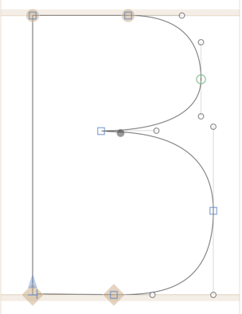

# ufostroker

## Add path effects to open contours in a UFO file

Given a glyph with open contours:

You can apply a noodle effect:

`ufostroker -i Open.ufo -o Output.ufo noodle --size 30`

Or you can choose a glyph from the UFO with closed contours (in this case the `star` glyph) and apply a pattern-along-path effect:

`ufostroker -i Open.ufo -o Output.ufo pattern -p star --spacing 30 --stretch true`

## To build

* Install rust
* `cargo build`

## Acknowledgements

All the heavy lifting is done by Matthew Blanchard and Fred Brennan's [MFEK Math](https://github.com/MFEK/math.rlib) library.

## License

This software is licensed under the Apache License, 2.0
